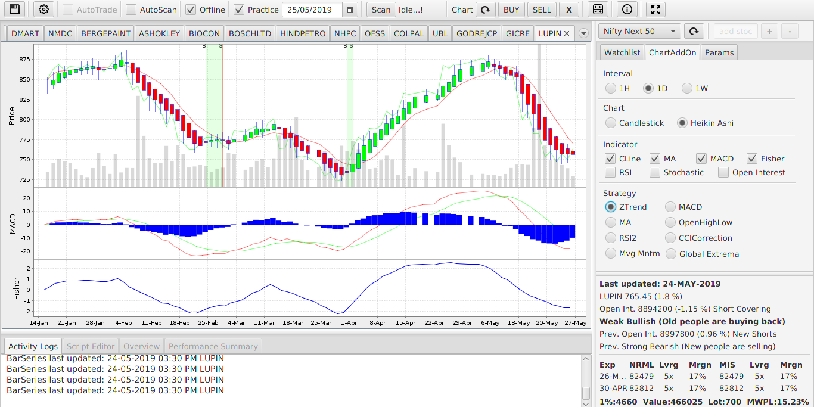

# WaveSignal

**Welcome to WaveSignal** – your comprehensive technical analysis software developed by νίĻάş ήίήάώέ to empower traders and investors with valuable tools and insights for the stock and futures markets.

## Features of WaveSignal

**1. Historical Data Analysis**
   - Dive into the world of technical analysis by practicing on historical data.
   - Visualize price movements, patterns, and trends to make informed trading decisions.

**2. Live Signal Generation**
   - Harness the power of popular trading strategies to generate real-time buy/sell signals.
   - Stay ahead of market trends and seize opportunities as they arise.

**3. Record Keeping**
   - Keep track of your practice and live trades with ease.
   - Monitor your performance and continuously improve your trading skills.

**4. Backtesting**
   - Test your trading strategies on historical data to evaluate their effectiveness.
   - Optimize your approach and refine your trading techniques.

**5. Free EOD Data**
   - Access End of Day (EOD) data from the National Stock Exchange (NSE) to stay updated on market trends.
   - Make informed investment decisions based on accurate data.

**6. Live Data Feed**
   - Enjoy live data feeds from NSE, Yahoo, ETimes, and more sources.
   - Receive real-time market information to act swiftly in dynamic market conditions.

Visit our website for more information and updates: [WaveSignal Website](https://sites.google.com/view/wavesignal)

WaveSignal is your trusted companion on your trading journey, providing the tools you need to excel in the financial markets. Whether you're a seasoned trader or just starting, this software is designed to enhance your trading skills and decision-making processes.
